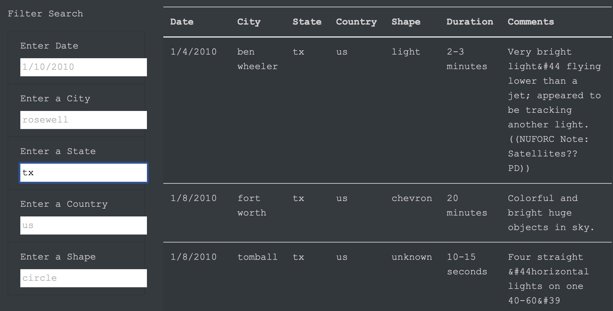
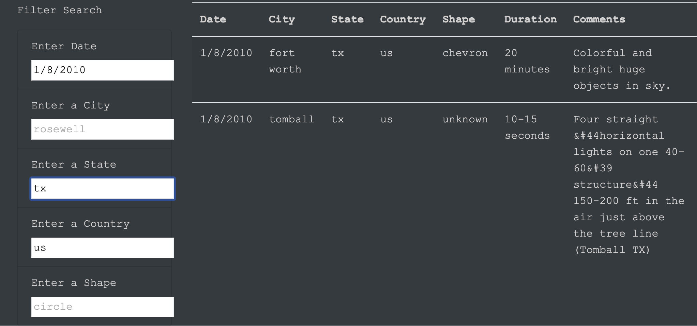

# UFO Sightings
[> Click here! 👽](https://xumed001.github.io/JavaScript_UFO/)
## Overview 
A simple website that has UFO sightings data and provides a more in-depth analysis of UFO sightings. Allows users to filter for multiple criteria at the same time with multiple filters search boxes.

## Results
To perform a search simply add filters in the search box that matches the suggestions. To clear the search results, refresh the page or click on the navigation bar on the top of the website.

- In the multiple available search boxes, filtering through one search criteria.

      

- In the search boxes, filtering through multiple search criteria.

     

## Summary 
One drawback of this simple webpage is it's lacking Ease-of-use, for example having to manually type the search parameter and (Users) not knowing the scope of data available to search through. My first additional recommendation for this website would be to add a dropdown list for all search criteria instead of having the user blindly searching. And second recommendation is to add more links realated to the information the search data provides ( like a wiki link of the incident ) when a user gets their search results.
